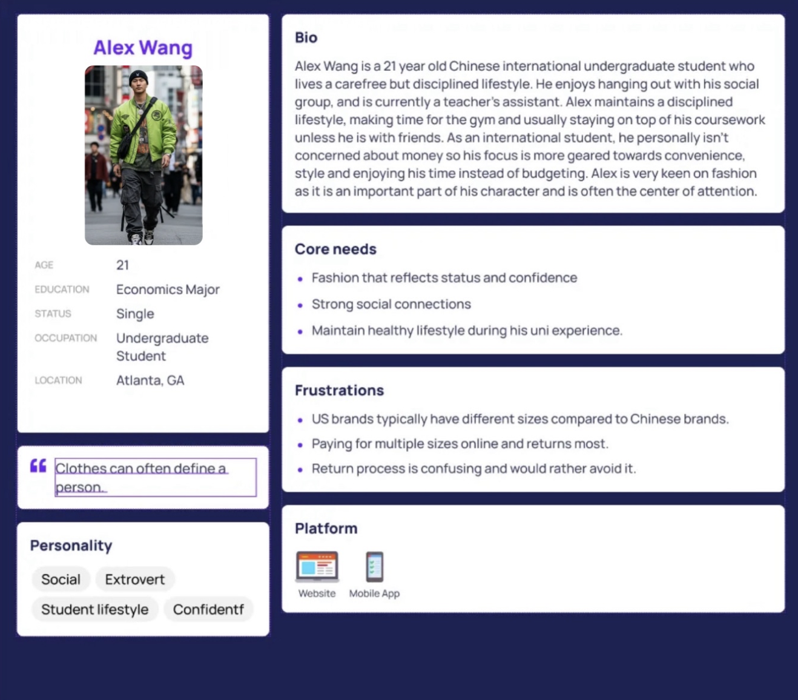
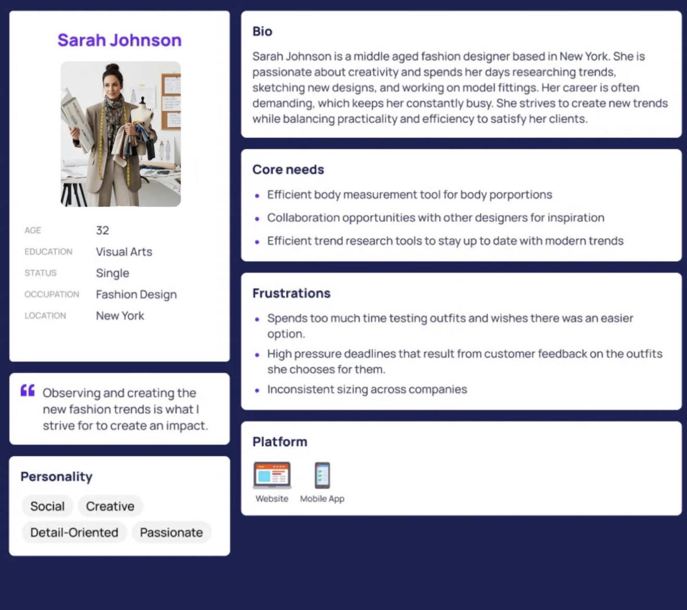
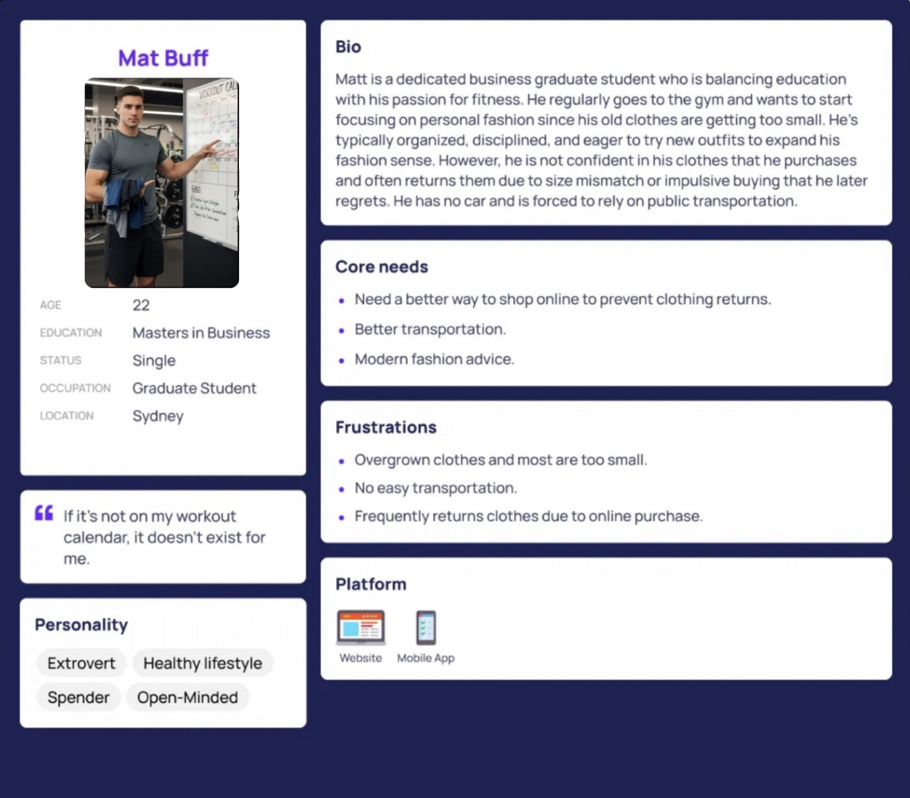
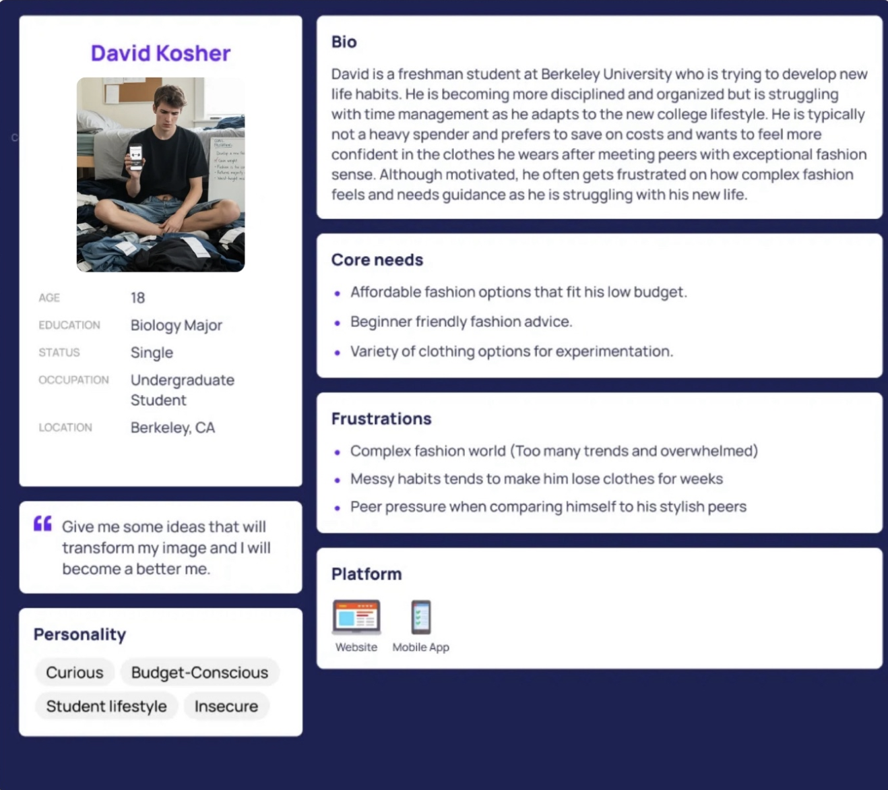
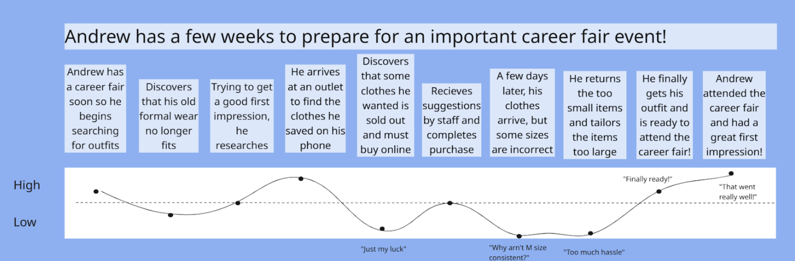
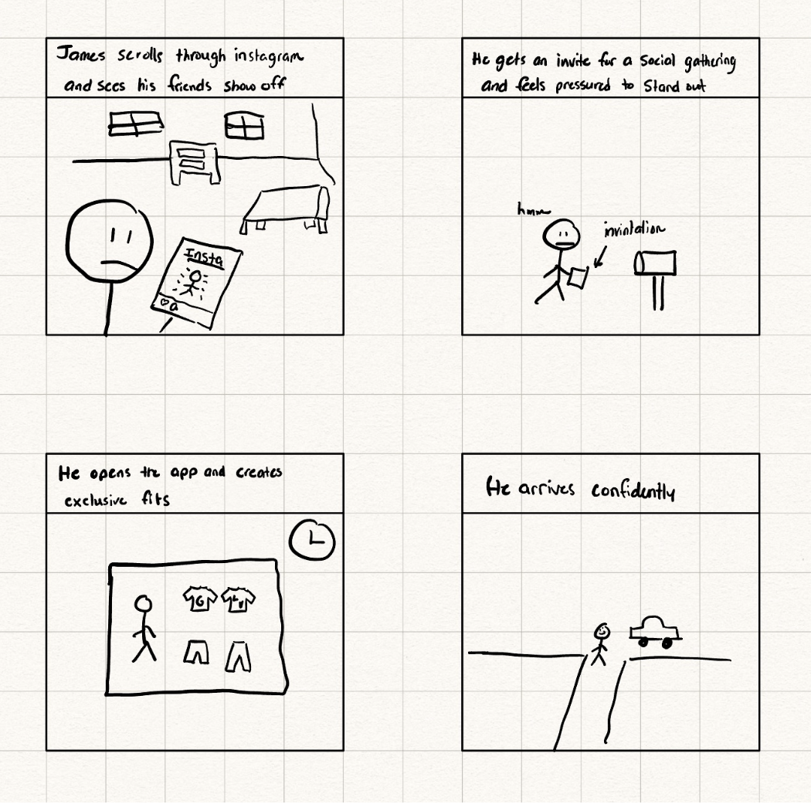
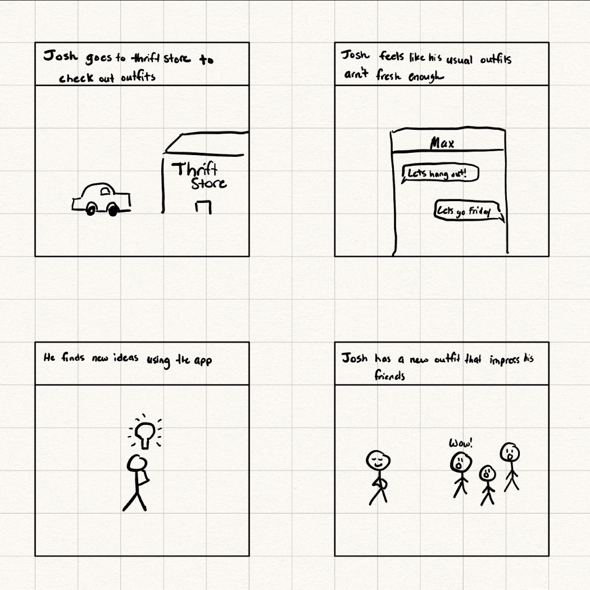
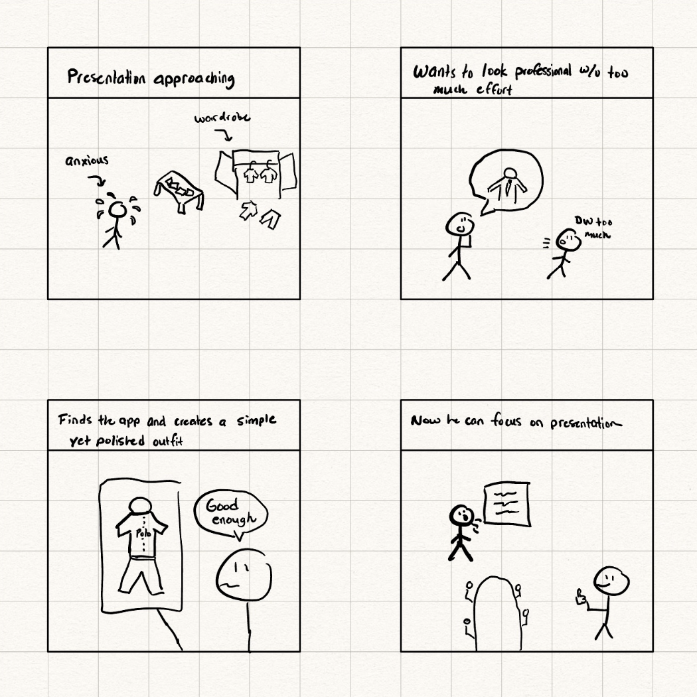
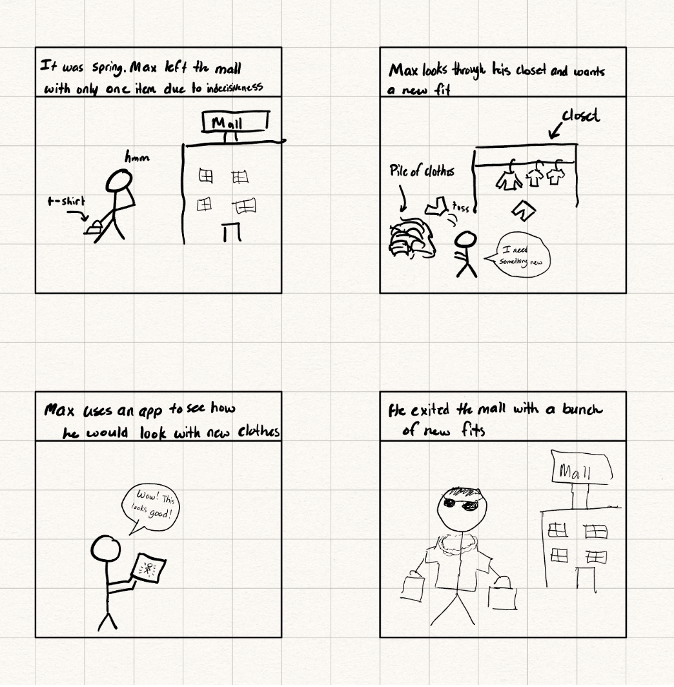

# SmartFit - A Virtual Try-On Clothing Application: See how clothes fit you before buying!

## Description

Young adults typically struggle with clothing shopping and are much more open to experimentation to discover their personal fashion sense. However, some items could be sold out in stores or online orders do not fit as expected, resulting in excess amounts of time returning or tailoring outfits whether it be due to size/proportion mismatch or due to the item not fitting in with the rest of their wardrobe. Although the audience range of this is very broad with the term “young adult”, it is not limited to the broad definition and can be tailored towards students who want to explore new fashion personalizations, social media influencers, and/or fashion designers. However, our main target audience are college students who care about fashion while balancing affordability and brand recognition.
This app allows users to virtually try on clothes to see if they fit their body on a smartphone camera. This solves the problem that users face when they are unable to determine if online clothes fit them before receiving the product. An AI style tool where users can give a link to some clothing item, then the user is able to see through their phone camera how the given clothing looks virtually. For precise estimations, the user can input their measurements (waist/height) to receive visual confirmation that a piece of clothing will fit on the individual. The user may also have a virtual wardrobe which stores the clothing items that the user has searched previously, so they can experiment with different outfits that meet their personal goals.
The main idea is that when the user is online shopping, despite seeing how the clothes fit on the models, they are unable to see how it would look on themselves. This app would solve that by allowing users to see potential items in real-time and help them determine if a particular outfit works for him/herself. This would theoretically help reduce the amount of time students spend on returning or tailoring certain clothing if it seems unfit, and allow them to understand their personal fashion ideas. 

## Main Problem

Our audience faces multiple problems such as:

Fit uncertainty (size) - Currently product images places clothes on models/avatars and not the individual buying the clothes. This gives the customer a rough estimate on how the clothes would look, but fails to demonstrate how an outfit would look on the customer for a more accurate display.

Wasting time/money - Many customers are unsatisfied in their clothing item purchase due to many factors (size/style/fashion) and waste time by returning or tailoring. Our application aims to help our audience by reducing time/money.

Outfit/Fashion - Many brands now currently have multiple styles available and different types of clothes that companies have decided as the standard for society. However, this may be overwhelming for people since there are too many options, creating uncertainty and confusion.

## Success Metrics

1.1 There should be an app made for iOS devices (essential)

1.2 The user is able to use the camera in the app (essential)

1.3 The user should be able to record and capture how they look in the app (essential)

1.4 The clothing item can be successfully shown on top of the camera view (essential)

2.1 The user can give the link to a clothing item (essential)

2.2 The link can be accessed and stored on the app (essential)

2.3 The images for the clothing item can be shown on the app (essential)

2.4 The user should be able to keep track of their clothes on the app (essential)

## Requirements

The application should have the following:

Clothing link authenticator/integration
    Allows users to input a clothing link (URL) to import clothing piece

Virtual body simulation
    Accepts user body measurements to improve fitting accuracy
    Users should be able to adjust their measurements whenever

Fit estimation
    Determines if the clothing the user picked will fit the individual using the app

Virtual Wardrobe
    Users should have a virtual wardrobe separating clothing items by type (shirt, pants, etc)

Outfit View
    Users should be able to try on clothing pieces to determine how they would look

### Functional

### Non-functional

### Ethical

Never store images/measurements without consent from the user
Will collect only the necessary data required for app to function
Users should be able to delete their images/data anytime
Bias free (No one should have restricted access based on ethnicity/demographics)
No images generated should be harmful for the user
Encryption will store sensitive data (username/password) for users
Avoid unrealistic images that may result in a negative reaction from user (body morphing)
Will not include a social media aspect that may induce social anxiety or body shaming
Will support all genders identities
Age appropriate regulation

## User Dimensions Analysis

We considered multiple dimensions to categorize our target users:

1. **Fashion Sense (High/Low)** - How much users value fashion and trends
2. **Budget (High/Low)** - How much users are willing to spend on clothing
3. Tech Savviness (High/Low) - User's comfort with technology
4. Shopping Frequency (Regular/Occasional) - How often users shop for clothes

**Prioritization Rationale:**
We selected Fashion Sense and Budget as our two primary dimensions because:
- These two factors most directly influence clothing purchase decisions
- Our customer interviews revealed these as the strongest differentiators
- Tech savviness showed less variation among college students (our target)
- Shopping frequency correlated closely with fashion sense

## Target Users

After conducting the interviews, I decided to split my personas into 4 categories distinguished by how much emphasis they put into fashion and how much of a budget they are willing to spend. The first aspect is very self explanatory as an individual with high fashion sense would likely value fashion much more than a person with low fashion sense in which they would likely not have put too much thought in what they wear as long as it’s comfortable and works. The other category of budget can be a bit trickier. Some people prefer luxurious products such as Gucci, Louis Vuitton, etc and won’t mind spending extra for designer brand names. However, most people would likely not be willing to afford such luxurious items, but still recognize brands such as American Eagle, Hollister, Uniqlo, and etc, which places them in the neutral point. Individuals who value spending less for clothes are categorized in the low budget criteria . 
I decided on these two aspects to divide up my persona map into four quadrants since each person in their respective quadrants likely live different lifestyles since they have different values/mindset that influences the clothes that they choose. These people can be categorized as such: 

### User Personas

High Fashion/High Budget:
These people are likely more carefree and outgoing people who believe that the clothes/fashion of people help define who they are. They would be the people who would keep up with the latest fashion trends and know when new items are being released.

High Fashion/Low Budget:
Individuals who likely enjoy finding a creative/original outfit that doesn’t necessarily include items with expensive logos/names. They might favor small local clothing shops and shop in outlets for potentially cheaper prices.

Low Fashion/High Budget
These people don’t necessarily care about fashion trends or styles but rather feel more confident in the value of a brand association/more luxurious clothes. 

Low Fashion/Low Budget:
These people don’t care about their fashion choices, but wear clothes that are more comfortable and sustainable for their everyday life. They could be curious about new fashion trends and might want to change their wardrobe, but are uncertain on how to achieve that.

## Tasks

### Journy Mapping

### User Stories

#### High Fashion/High Budget
(High – Alex Wang) As a student attending a campus career fair, I want curated outfit recommendations for professional events so that I can feel confident and make a strong first impression with recruiters.
(Low - Jeremy) As an international student who enjoys high fashion and luxury brands, I want to discover exclusive and trendy pieces so I can stand out confidently among my peers.
(Medium - John Smith) As a fashion designer developing new potential clothing trends, I want to explore more clothing combinations so I can satisfy my clients.
#### High Fashion/Low Budget
(Medium - Matt Buff) As a low budget student who still values fashion, I want to find stylish clothes from affordable stores so I can look fashionable without overspending.
(High - James) As a student with a higher budget, I want reliable sizing and fit suggestions from fashion stores so I can avoid frequent returns and tailoring costs.
(Low - David ) As a beginner social media influencer, I want to wear iconic clothes from high brands so I can grow my online presence and attract collaborations.
#### Low Fashion/High Budget
(High Richard) As a student who prioritizes luxurious/high quality clothing, I want to buy staple items from well-known labels so I can feel confident through brand association.
(Low - Emily) As a social media influencer, I want new ideas based on outfits mixed with luxury and/or affordable brands so I can create inspiring posts that attract new followers.
(Medium - Koby) As a foreign exchange student ( freshman ) new to the U.S., I want to buy familiar domestic brands so I can feel comfortable and fit in with my peers.
#### Low Fashion/Low Budget
(High - David Kosher) As a new freshman student, I want to increase the variety of clothes in my wardrobe so that I can be more confident in the way I present myself in public.
(Medium - Amanda ) As a student who is just getting into fashion, I want to explore simple, low cost clothing options so I can experiment on new outfits without worrying too much about costs.
(Low - Ryan) As someone not interested in trends, I want to quickly find basic, comfortable clothing so I can minimize shopping and focus on other tasks in my day. 

### Storyboards
#### High Fashion/High Budget

#### High Fashion/Low Budget

#### Low Fashion/High Budget

#### Low Fashion/Low Budget

## Technologies

### Platform
- **iOS Native Mobile App** (iPhone, iOS 14+)
- Camera-based AR try-on experience

### Core Technology Stack

**Frontend:**
- Swift/SwiftUI - iOS development
- ARKit - Augmented reality
- AVFoundation - Camera integration
- Core ML - On-device machine learning

**Backend:**
- JavaScript (Node.js + Express) OR Python (Flask) - API server
- MongoDB - Database
- AWS S3 - Image storage
- JWT - Authentication

**AI/ML:**
- Hugging Face SAM Model (`facebook/sam-vit-base`) - Image segmentation
  - URL: https://huggingface.co/facebook/sam-vit-base
- Custom ML model - Fit prediction (architecture TBD)

**Integrations:**
- E-commerce APIs for product data (specific retailers TBD)
- Web scraping for stores without APIs

### Development & Security
- Git/GitHub - Version control
- Encrypted data storage and transmission
- User privacy protection
